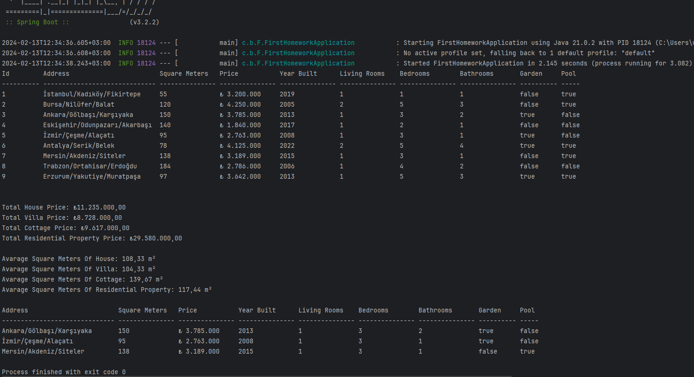

# Real Estate Management System

## Overview
This project is designed to manage residential properties, including houses, villas, and cottages. It allows for tracking property details, calculating total and average prices, and filtering properties based on specific criteria. The system is built using Java and Spring Boot, demonstrating object-oriented programming principles, inheritance, and the use of annotations for dependency injection and service configuration.

## Classes and Functionalities

### `ResidentialProperty`
An abstract class that serves as the base for different types of residential properties. It holds common attributes such as address, square meters, price, year built, number of living rooms, bedrooms, bathrooms, and amenities like garden and pool. Unique IDs are automatically generated for each property.

#### Attributes:
- `id`: Unique identifier for each property.
- `address`: Location of the property.
- `squareMeters`: Size of the property in square meters.
- `propertyPrice`: Price of the property.
- `yearBuilt`: Year the property was built.
- `numLivingRooms`: Number of living rooms.
- `numBedrooms`: Number of bedrooms.
- `numBathrooms`: Number of bathrooms.
- `hasGarden`: Indicates if the property has a garden.
- `hasPool`: Indicates if the property has a pool.

### `House`, `Villa`, `Cottage`
Concrete classes that extend `ResidentialProperty`, representing different types of residential properties. Each class inherits the attributes and methods from the `ResidentialProperty` class but can be extended with specific features or behaviors in the future.

### `ResidentialPropertyService`
A service class annotated with `@Service` that manages a collection of `ResidentialProperty` objects. It provides functionalities to add properties to the list, retrieve the list, calculate total and average prices, filter properties by number of rooms, and print property details in a tabular format.

#### Key Methods:
- `addResidentialProperty`: Adds a new property to the list.
- `getResidentialPropertyList`: Returns the list of properties.
- `printAllResidentialPropertiesTable`: Prints all property details in a table.
- `getTotalPriceOfResidentialProperty`: Calculates the total price of all properties.
- `getTotalPriceOfPropertyType`: Calculates the total price of properties of a specific type.
- `getAverageSquareMetersOfResidentialProperty`: Calculates the average size of all properties.
- `getAverageSquareMetersOfPropertyType`: Calculates the average size of properties of a specific type.
- `getFilterPropertyByRooms`: Filters properties by the number of bedrooms and living rooms.
- `printFilterPropertyByRoomsTable`: Prints details of filtered properties in a table.

### `Conf`
A configuration class annotated with `@Configuration`, responsible for setting up the initial properties and injecting the `ResidentialPropertyService` into the Spring application context using `@Autowired`.

### `FirstHomeworkApplication`
The main class of the application, annotated with `@SpringBootApplication`. It runs the Spring application, utilizes the `ResidentialPropertyService` to perform operations, and demonstrates the system's functionalities by printing property details and statistics.
```java
public static void main(String[] args) {
		ApplicationContext context = SpringApplication.run(FirstHomeworkApplication.class, args);

		ResidentialPropertyService residentialPropertyService = context.getBean(ResidentialPropertyService.class);


		residentialPropertyService.printAllResidentialPropertiesTable();

		System.out.println("\n");

		System.out.println("Total House Price: " + String.format("₺%,.2f",residentialPropertyService.getTotalPriceOfPropertyType(House.class)));

		System.out.println("Total Villa Price: " + String.format("₺%,.2f",residentialPropertyService.getTotalPriceOfPropertyType(Villa.class)));

		System.out.println("Total Cottage Price: " + String.format("₺%,.2f",residentialPropertyService.getTotalPriceOfPropertyType(Cottage.class)));

		System.out.println("Total Residential Property Price: " + String.format("₺%,.2f",residentialPropertyService.getTotalPriceOfResidentialProperty())+"\n");

		System.out.println("Avarage Square Meters Of House: " + String.format("%,.2f",residentialPropertyService.getAverageSquareMetersOfPropertyType(House.class)) + " m\u00B2");

		System.out.println("Avarage Square Meters Of Villa: " +  String.format("%,.2f",residentialPropertyService.getAverageSquareMetersOfPropertyType(Villa.class)) + " m\u00B2");

		System.out.println("Avarage Square Meters Of Cottage: " + String.format("%,.2f",residentialPropertyService.getAverageSquareMetersOfPropertyType(Cottage.class)) + " m\u00B2");

		System.out.println("Avarage Square Meters Of Residential Property: " + 	String.format("%,.2f",residentialPropertyService.getAverageSquareMetersOfResidentialProperty()) + " m\u00B2 \n");

		residentialPropertyService.printFilterPropertyByRoomsTable(3,1);

	}
```
	
	
	
### `Output`

